<div align="center">
  <h1>LIP_1 Guide</h1>
  <br/>
</div>

Before start, make sure you are inside the LIP_1 directory on the terminal

# 1. Dependency Setup

Check Common Guide's [Dependency Setup Section](../README.md#1.-Dependency-Setup)

## Install the dependencies

```
LIP_ID="LIP_1"
cd $HOME/liquidity-program/
git checkout $LIP_ID
cd $LIP_ID
npm install
```

# 2. Environment Variables (Accounts & Keys Setup)

Check Common Guide's [Setup Environment Variables Section](<../README.md#2.-Environment-Variables-(Accounts-&-Keys-Setup)>)

# 3. Testnet used and faucet references

Check Common Guide's [Testnet used and faucet references Section](../README.md#3.-Testnet-used-and-faucet-references)

# 4. Compile and Unit Testing

## Compile the smart contract with the provided command

```
 $ npm run build

 > kex@1.0.0 prebuild /Kira/liquidity-program/LIP_1
 > rimraf ./build/contracts/*


 > kex@1.0.0 build /Kira/liquidity-program/LIP_1
 > truffle compile

 Using env var PRIVATE_KEY conn...
 Using env var INFURA_APIKEY 7591...
 Using env var process.env.ETHERSCAN_APIKEY 0987...

 Compiling your contracts...
 ===========================
 > Compiling ./contracts/KiraToken.sol
 > Compiling ./contracts/Migrations.sol
 > Compiling openzeppelin-solidity/contracts/GSN/Context.sol
 > Compiling openzeppelin-solidity/contracts/access/Ownable.sol
 > Compiling openzeppelin-solidity/contracts/math/SafeMath.sol
 > Compiling openzeppelin-solidity/contracts/token/ERC20/ERC20.sol
 > Compiling openzeppelin-solidity/contracts/token/ERC20/IERC20.sol
 > Compiling openzeppelin-solidity/contracts/utils/Address.sol
 > Artifacts written to /Users/mac/Documents/Work/Kira/liquidity-program/LIP_1/build/contracts
 > Compiled successfully using:
    - solc: 0.6.2+commit.bacdbe57.Emscripten.clang
```

## Test the smart contract with the provided command. All testing should be passed

```
 $ npm run test

 > kex@1.0.0 test /Kira/liquidity-program/LIP_1
 > truffle test

 Using env var PRIVATE_KEY conn...
 Using env var INFURA_APIKEY 7591...
 Using env var process.env.ETHERSCAN_APIKEY 0987...
 Using network 'test'.

 Compiling your contracts...
 ===========================
 > Everything is up to date, there is nothing to compile.

 Contract: KiraToken Test
    totalSupply
      ✓ all tokens should be in the deployer account
    freeze
      ✓ should be freezed at first and the transfer should be rejected (97ms)
      ✓ should NOT be able to freeze when it was already freezed
      ✓ should reject freeze call from non owner
      ✓ should make the token as freeze when it was unfreezed (232ms)
    unfreeze
      ✓ should NOT be able to unfreeze when it was already unfreezed (67ms)
      ✓ should reject unfreeze call from non owner
      ✓ should make the token as unfreeze when it was freezed (298ms)
      ✓ should be able to transfer freely once unfreezed (140ms)
    whitelist
      ✓ onwer should have full whitelist
      ✓ should NOT be able to configure whitelist of 0 address
      ✓ should NOT be able to configure whitelist without owner permission (61ms)
      ✓ should whitelist any options of multiple addresses (114ms)
    blacklist
      ✓ should NOT be able to add 0x0 to the blacklist
      ✓ should NOT be able to remove 0x0 from the blacklist
      ✓ should NOT be able to add/remove blacklist without owner permission (99ms)
      ✓ should add to blacklist (68ms)
      ✓ should remove from blacklist (61ms)
    transfer when unfreezed
      ✓ should NOT be able to transfer (from: blacklisted) (136ms)
      ✓ should NOT be able to transfer (to: blacklisted) (133ms)
      ✓ should transfer (from: blacklisted [no], to: blacklisted [no]) (217ms)
    transfer when freezed
      ✓ should NOT be able to transfer (from: blacklisted) even if its allow_transfer is true (235ms)
      ✓ should NOT be able to transfer (to: blacklisted) even if its allow_deposit is true (496ms)
      ✓ should NOT be able to transfer (from: allow_transfer [no], to: allow_deposit [yes]) (183ms)
      ✓ should NOT be able to transfer (from: allow_transfer [yes], to: allow_deposit [no]) (303ms)
      ✓ should transfer (from: allow_transfer [yes], to: allow_deposit [yes]) (180ms)
      ✓ should transfer (from: allow_unconditional_transfer [yes], to: allow_deposit [no]) (326ms)
      ✓ should transfer (from: allow_transfer [no], to: allow_unconditional_deposit [yes]) (377ms)
    multi transfer
      ✓ should be able to transfer to multiple accounts (136ms)


  29 passing (7s)
```

# 5. Example Deployment and expected output

## Deploy to Local Testnet

```
npm run build & npm run deploy:development
```

## Deploy to Kovan testnet

Make sure the private key has enough test ether on the Kovan test network to fund the deployment transactions.

```
$ npm run build & npm run deploy:kovan
Using env var PRIVATE_KEY prai...
Using env var INFURA_APIKEY 7591...
Using env var process.env.ETHERSCAN_APIKEY 0987...

Compiling your contracts...
===========================
> Everything is up to date, there is nothing to compile.


Starting migrations...
======================
> Network name:    'kovan'
> Network id:      42
> Block gas limit: 12500000 (0xbebc20)


1_initial_migration.js
======================

   Deploying 'Migrations'
   ----------------------
   > transaction hash:    0x9e15c6376ea7d4c2aa36006fd751fec9e88096967b341bd6fe442bde9dab6b3c
   > Blocks: 5            Seconds: 21
   > contract address:    0x25B942b96a25eaAb5e9E5640444F17AD8e10c59c
   > block number:        20974338
   > block timestamp:     1600344328
   > account:             0x25bfE1d866e7288E2Ed7bb97De42cb8F3A07Dd90
   > balance:             0.99662996
   > gas used:            168502 (0x29236)
   > gas price:           20 gwei
   > value sent:          0 ETH
   > total cost:          0.00337004 ETH


   > Saving migration to chain.
   > Saving artifacts
   -------------------------------------
   > Total cost:          0.00337004 ETH


2_deploy_contract.js
====================

   Deploying 'KiraToken'
   ---------------------
   > transaction hash:    0xfd0dbea4735b36e4a59c2f2c48febd2d905e9b5a8405c5c6a7a69a5c6d8f5d1b
   > Blocks: 1            Seconds: 6
   > contract address:    0x982D5EC2f486b7cd7C31BD1d2299e94cAfE036cf
   > block number:        20974347
   > block timestamp:     1600344364
   > account:             0x25bfE1d866e7288E2Ed7bb97De42cb8F3A07Dd90
   > balance:             0.97041096
   > gas used:            1268671 (0x135bbf)
   > gas price:           20 gwei
   > value sent:          0 ETH
   > total cost:          0.02537342 ETH


   > Saving migration to chain.
   > Saving artifacts
   -------------------------------------
   > Total cost:          0.02537342 ETH


Summary
=======
> Total deployments:   2
> Final cost:          0.02874346 ETH
```

In this example the smart contract was deployed to the address `0x982D5EC2f486b7cd7C31BD1d2299e94cAfE036cf` on the Kovan Test network. The address `0x25bfE1d866e7288E2Ed7bb97De42cb8F3A07Dd90` gained ownership to the smart contract and received 300000000 tokens.

## Verification

In order to verify your smart contract on etherscan.io execute the verification script immediately after the contract is successfully deployed and pass the contract name as the argument.

```
$ npm run verify:kovan -- KiraToken
> kex@1.0.0 verify:kovan /home/mac/Desktop/liquidity-program/LIP_1
> truffle run verify KiraToken --network kovan

Using env var PRIVATE_KEY prai...
Using env var INFURA_APIKEY 7591...
Using env var process.env.ETHERSCAN_APIKEY SFP4...
Verifying KiraToken
Pass - Verified: https://kovan.etherscan.io/address/0x982D5EC2f486b7cd7C31BD1d2299e94cAfE036cf#contracts
Successfully verified 1 contract(s).
```

## Screenshot on Etherscan

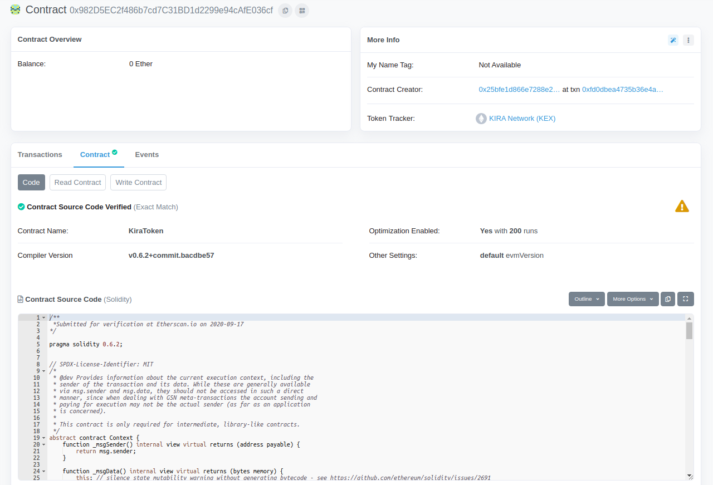

# 6. Instructions for interacting with the contract

## Check if all tokens (300,000,000 KEX) is in the deployed account

Add KEX token as a custom token in your MetaMask wallet

1.  Click `Add Token` Button on your MetaMask
2.  On the `Add Token` page, click on `Add custom token` to expand the search window.
3.  Enter token address `0x982D5EC2f486b7cd7C31BD1d2299e94cAfE036cf` in the space under `Token Address`.
4.  Click next to proceed

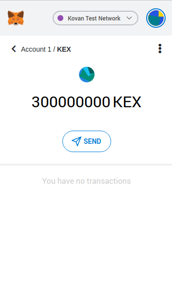

## The token should be freezed at first and the transfer should be rejected

1.  Try to send any amount of tokens from the deployed account to other address
    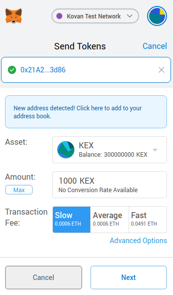
2.  The transaction should be failed because the token is freezed and the recipient address is not whitelisted. (The deployer address is whitelisted as default)
    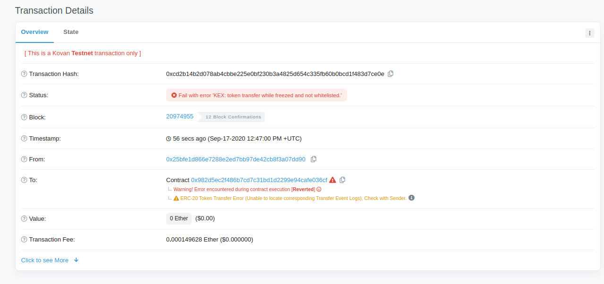

Lets generate ABI so that we can interact with the contract:

```
apt-get install xclip
npm install -g truffle-export-abi
truffle-export-abi
cat ./build/ABI.json | xclip -selection c
```

Output should be a long peace of JSON formatted text, that can be copied also from [here](./ABI.json)

ABI we can now input into any wallet like MEW to interact with the contract

## Once unfreeze the token, it should be able to transfer freely

1.  Only token owner can unfreeze the token.
    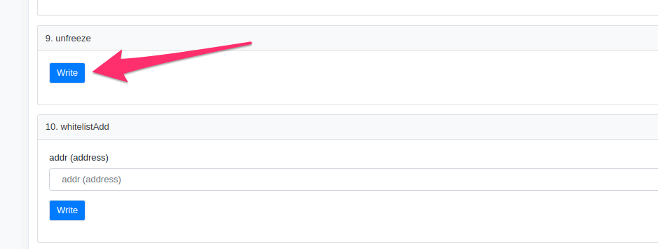
2.  Try to send any amount of tokens between any accounts
    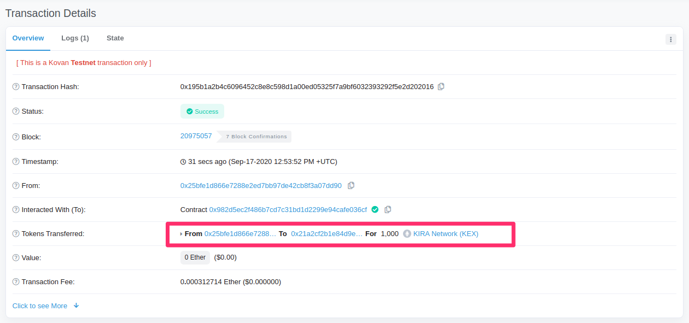

## Freeze the token transfer and configure list of addresses to whitelist

1.  Only token owner can freeze the token
    
2.  Configure whitelist. (Only owner can configure whitelist)
    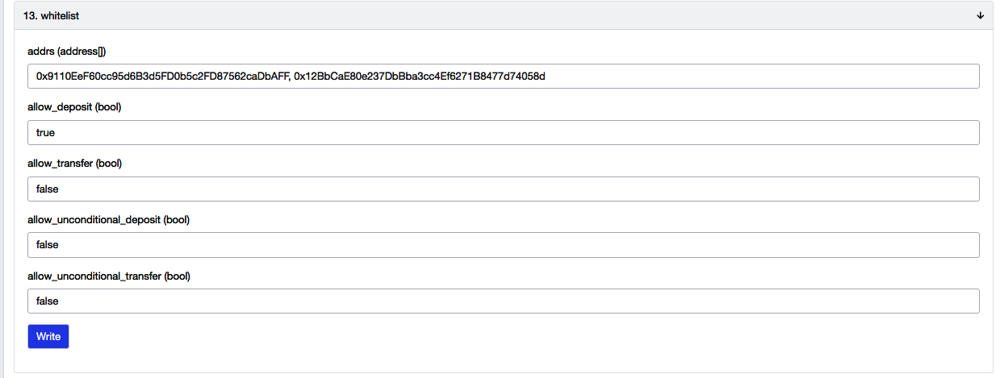
3.  Should be able to transfer between whitelisted addresses even if the token transfer is freezed
    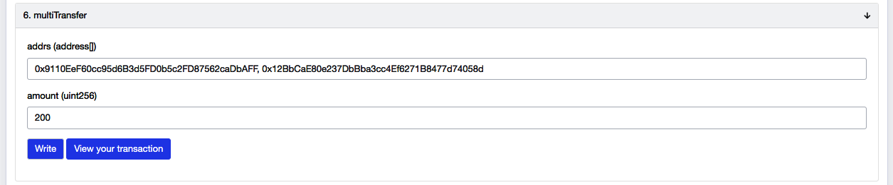
    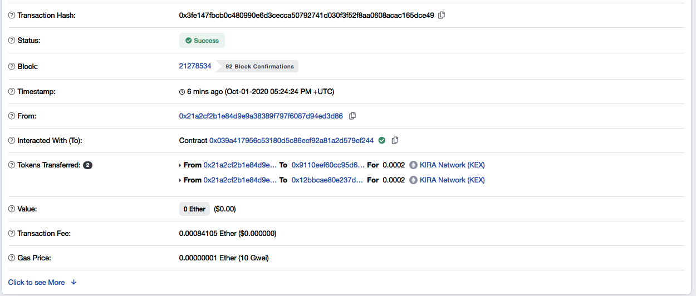

## Compatibility with uniswap v2

    Make sure the token transfer is not freezed

1. Add Liquidity to Uniswap (https://app.uniswap.org/#/pool)
   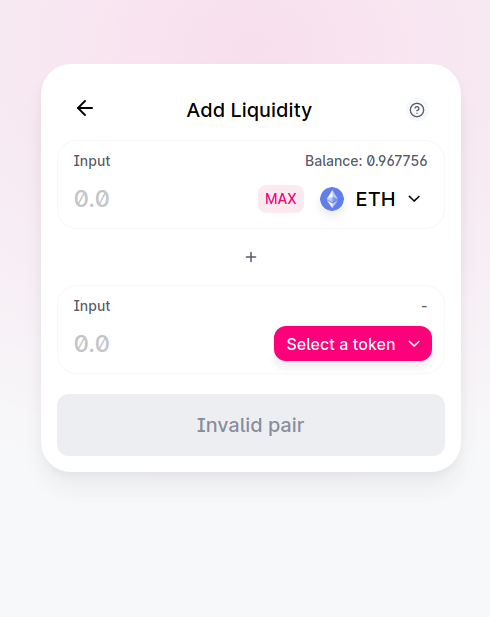
2. Select token pairs (ETH & KEX). Select KEX token by searching with KEX contract address
   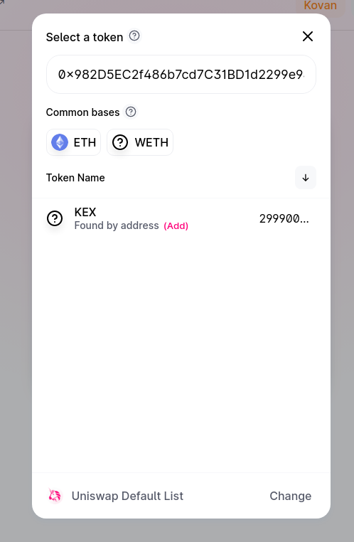
3. Our pool

   

# TODO

- [x] TODO: Update readme as whitelist method changed
- [x] TODO: Add more unit testing
