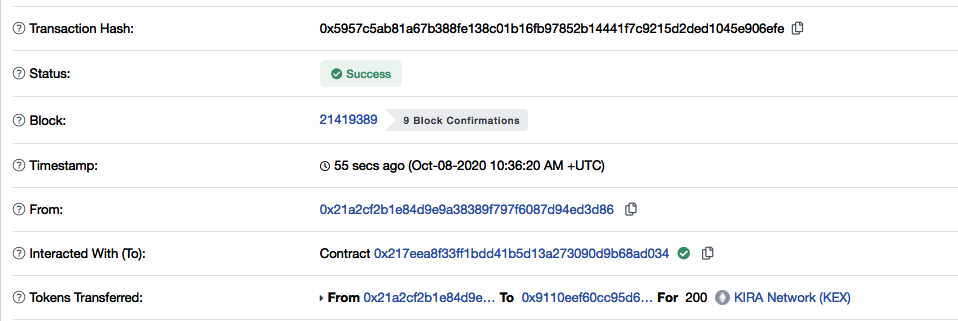
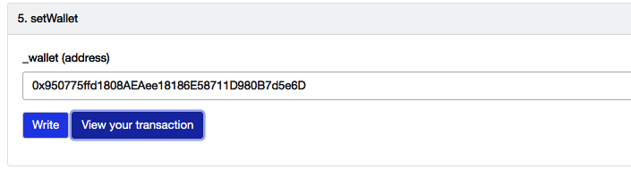
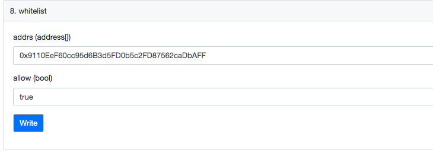
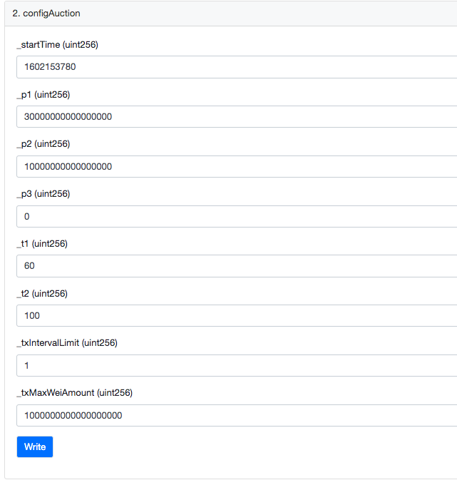
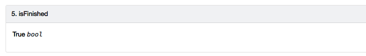
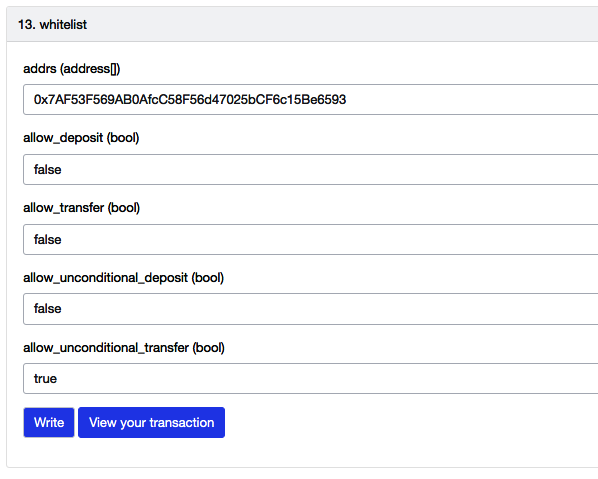
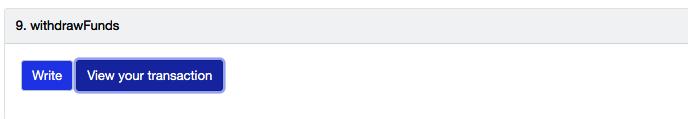

<div align="center">
  <h1>LIP_3 Guide</h1>
  <br/>
</div>

Before start, make sure you are inside the LIP_3 directory on the terminal

# 1. Dependency Setup

Check Common Guide's [Dependency Setup Section](../setup.md)

## Install the dependencies

```
LIP_ID="LIP_3"
cd $HOME/liquidity-program/
git checkout $LIP_ID
cd $LIP_ID
npm install
cp $HOME/liquidity-program/LIP_1/contracts/KiraToken.sol $HOME/liquidity-program/LIP_3/contracts
```

# 2. Environment Variables (Accounts & Keys Setup)

Check Common Guide's [Setup Environment Variables Section](<../README.md#2.-Environment-Variables-(Accounts-&-Keys-Setup)>)

### `KIRA_TOKEN_ADDRESS`

- The contract address of Kira Network (KEX) which you deployed. (start with 0x)

```
echo "KIRA_TOKEN_ADDRESS=XXX...XXX" >> $HOME/liquidity-program/$LIP_ID/.env
```

# 3. Testnet used and faucet references

Check Common Guide's [Testnet used and faucet references Section](../README.md#3.-Testnet-used-and-faucet-references)

# 4. Compile and Unit Testing

## Compile the smart contract with the provided command

```
 $ npm run build
> kira-auction@1.0.0 prebuild /Kira/liquidity-program/LIP_3
> rimraf ./build/contracts/*

> kira-auction@1.0.0 build /Kira/liquidity-program/LIP_3
> truffle compile

Using env var PRIVATE_KEY conn...
Using env var INFURA_APIKEY 7591...
Using env var process.env.ETHERSCAN_APIKEY SFP4...

Compiling your contracts...
===========================
> Compiling ./contracts/KiraAuction.sol
> Compiling ./contracts/KiraToken.sol
> Compiling ./contracts/Migrations.sol
> Compiling openzeppelin-solidity/contracts/GSN/Context.sol
> Compiling openzeppelin-solidity/contracts/access/Ownable.sol
> Compiling openzeppelin-solidity/contracts/math/SafeMath.sol
> Compiling openzeppelin-solidity/contracts/token/ERC20/ERC20.sol
> Compiling openzeppelin-solidity/contracts/token/ERC20/IERC20.sol
> Compiling openzeppelin-solidity/contracts/utils/Address.sol
> Artifacts written to /Users/mac/Documents/Work/Kira/liquidity-program/LIP_3/build/contracts
> Compiled successfully using:
   - solc: 0.6.2+commit.bacdbe57.Emscripten.clang
```

## Test the smart contract with the provided command. All testing should be passed

```
 $ npm run test
> kira-auction@1.0.0 test /Kira/liquidity-program/LIP_3
> truffle test

Using env var PRIVATE_KEY abc...
Using env var INFURA_APIKEY 123...
Using env var process.env.ETHERSCAN_APIKEY 0987...
Using network 'development'.


Compiling your contracts...
===========================
> Compiling ./contracts/KiraAuction.sol
> Artifacts written to /var/folders/m5/s6r4jc2n683grgxld0r1hgch0000gn/T/test--1387-Y60j8u54aM9J
> Compiled successfully using:
   - solc: 0.6.2+commit.bacdbe57.Emscripten.clang

  Network:  development
  Predefined Address:  0xD9080E29a3CCD2eD6D7AC280Adc6c3bfC5316252

  Contract: KiraAuction Test
    KiraAuction
      ✓ KiraToken should be configured once deployed
      ✓ wallet should be the owner once deployed
    configAuction
      ✓ should only be callable by the owner (58ms)
      ✓ should only be callable before auction starts (2111ms)
      ✓ can't set set the startTime as old time
      ✓ should set the auction price as decreasing (44ms)
      ✓ first slope's decreasing rate should be bigger than the second one
      ✓ slope times should be valid
      ✓ max size per transaction should be valid
      ✓ should set the variables properly (should convert to the ether unit) (88ms)
    setWallet
      ✓ wallet should only be configurable by the owner
      ✓ wallet should only be configurable before auction starts (3091ms)
      ✓ wallet should be set properly (1142ms)
    whitelist
      ✓ whitelist should only be called by the owner (39ms)
      ✓ whitelist should only be called before auction starts (3090ms)
      ✓ wallet should be set properly (137ms)
    deposit
      ✓ should be rejected before the auction (1159ms)
      ✓ should be rejected after the auction (5091ms)
      ✓ owner or address(0) should not be able to participate in the auction (1112ms)
      ✓ should be rejected from not whitelisted account (1122ms)
      ✓ amount should be greater than the MIN_WEI (1204ms)
      ✓ amount should not exceed the MAX_WEI (1183ms)
      ✓ should be rejected when it exceeds the tx rate limit (1399ms)
      ✓ should be rejected if it exceeds the hard cap (3291ms)
      ✓ should update the total deposited amount, latest price and user info properly (5305ms)
    claimTokens
      ✓ should only be called after auction ends (3133ms)
      ✓ should be rejected if non-whitelisted user tries to claim (5123ms)
      ✓ should be rejected if whitelisted & non-deposited user tries to claim (5182ms)
      ✓ should transfer the proper amount of tokens to the claimer (7475ms)
      ✓ should not be able to claim after distribution (7525ms)
      ✓ should not be able to distribute after all claimed (7484ms)
      ✓ should distribute proper amount of tokens to contributors (7516ms)
    withdrawFunds
      ✓ should only be called from the owner (49ms)
      ✓ should only be called after auction ends (3128ms)
      ✓ should be rejected if there is no balance on the contract (5100ms)
      ✓ should withdraw ETH and KEX correctly (10584ms)


  36 passing (2m)
```

# 5. Example Deployment and expected output

## Deploy to Local Testnet

```
npm run build & npm run deploy:development
```

## Deploy to Kovan testnet

Make sure the private key has enough test ether on the Kovan test network to fund the deployment transactions.

```
$ npm run build & npm run deploy:kovan
```

## Verification

In order to verify your smart contract on etherscan.io execute the verification script immediately after the contract is successfully deployed and pass the contract name as the argument.

```
$ npm run verify:kovan KiraAuction
```

- KiraAuction: https://kovan.etherscan.io/address/0x7AF53F569AB0AfcC58F56d47025bCF6c15Be6593#contractslink

# 6. Instructions for interacting with the contract

> Generate ABI so that we can interact with the contract:

```

truffle-export-abi
cat ./build/ABI.json | xclip -selection c
```

> Interact with the contract

- Send 200 KEX tokens to the Auction contract
  
- Set Withdraw account for ETH
  
- Set whitelist for `User 1` and `User 2`
  
- Config Auction Parameters (start time: 1602159300)
  
- Wait until the auction starts
- Wait 10 seconds and send 0.8 ether to the contract from `User 1`
- Wait 60 seconds and send 0.6 ether to the contract from `User 2`
- Wait 30 seconds and check `isFinished`
  
- Whitelist Token Transfer (allow unconditional transfer for the contract)
  
- Claim KEX from `User 1` and get ~114.28 KEX
- Claim KEX from `User 2` and get ~85.71 KEX
- Withdraw Funds and get `1.4` ether
  
