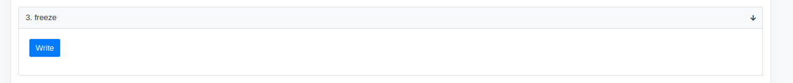
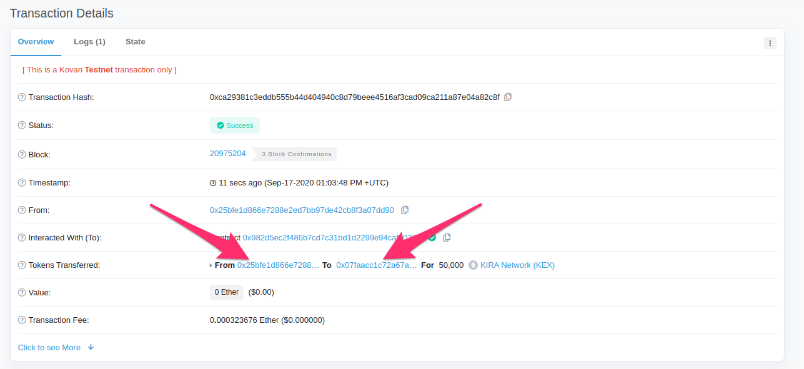
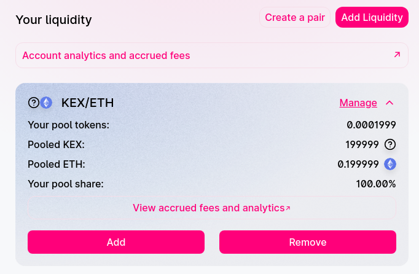

<div align="center">
  <h1>Kira Liquidity Program</h1>
  <br/>  
</div>

# 1. Dependency Setup

## Install Node.js & NPM on Ubuntu 20.04

```
$ sudo apt update
$ sudo apt install curl
$ curl -sL https://deb.nodesource.com/setup_14.x -o nodesource_setup.sh
$ sudo bash nodesource_setup.sh
$ sudo apt install nodejs
$ node -v
v14.11.0
$ npm -v
v6.14.8
```

## Install Git on Ubuntu 20.04

```
$ sudo apt install git
```

## Clone the repo and install the dependencies

```
$ git clone git@github.com:KiraCore/liquidity-program.git
$ cd liquidity-program/
$ git checkout LIP_1
$ npm install
```

## Install the desktop version of Ganache

Ganache will provide a personal blockchain to be used for local development and testing of smart contracts.

1.  Open a browser and navigate to https://github.com/trufflesuite/ganache/releases

2.  Download the latest Linux release which will be the \*.AppImage file.

3.  For example ganache-2.4.0-linux-x86_64.AppImage.

4.  Once the download is complete, open a new terminal and change into the directory with the \*.AppImage file.

5.  Use chmod to make the file executable:
    ```
    chmod a+x ganache-1.3.0-x86_64.AppImage
    ```
6.  Now run the file
    ```
    ./ganache-1.3.0-x86_64.AppImage
    ```

# 2. Environment Variables (Accounts & Keys Setup)

Each deployment environment has a different set of mandatory environment variables. Add the secrets required for the deployment environment to [.env](./.env)

### `PRIVATE_KEY`

Make sure to provide the 64 character long hexa-decimal `PRIVATE_KEY`. The associated address will inherit the tokens created by the contract deployment.
Let's setup MetaMask account and we can use Seed Phrase of the MetaMask wallet.

- Install Google Chrome
  ```
   $ sudo apt install gdebi-core wget
   $ wget https://dl.google.com/linux/direct/google-chrome-stable_current_amd64.deb
   $ sudo gdebi google-chrome-stable_current_amd64.deb
   $ google-chrome
  ```
- Install [MetaMask Google Chrome Extension](https://chrome.google.com/webstore/detail/metamask/nkbihfbeogaeaoehlefnkodbefgpgknn)
- Use the secret phrase of your MetaMask wallet as `PRIVATE_KEY`.

### `INFURA_APIKEY`

Sign up for a free api key at https://infura.io/dashboard to deploy to public networks.

- Create an account on [infura.io](https://infura.io)
- Create a new Project on your infura account
- Go to Settings Tab
- Use the Project ID as `INFURA_APIKEY`

### `ETHERSCAN_APIKEY`

- Generate the Etherscan API Key for free at https://etherscan.io/myapikey.

# 3. Testnet used and faucet references

## Ropsten Testnet

You can instantly get 1 Ropsten Test Ether per 24h per account by visiting https://faucet.ropsten.be/

## Kovan Testnet

You can instantly get 1 KEth per 24h per GitHub account by visiting https://faucet.kovan.network/ and submitting your Kovan address.

# 4. Compile and Unit Testing

## Compile the smart contract with the provided command

```
 $ npm run build

 > kex@1.0.0 prebuild /Kira/liquidity-program
 > rimraf ./build/contracts/*


 > kex@1.0.0 build /Kira/liquidity-program
 > truffle compile

 Using env var PRIVATE_KEY conn...
 Using env var INFURA_APIKEY 7591...
 Using env var process.env.ETHERSCAN_APIKEY 0987...

 Compiling your contracts...
 ===========================
 > Compiling ./contracts/KiraToken.sol
 > Compiling ./contracts/Migrations.sol
 > Compiling openzeppelin-solidity/contracts/GSN/Context.sol
 > Compiling openzeppelin-solidity/contracts/access/Ownable.sol
 > Compiling openzeppelin-solidity/contracts/math/SafeMath.sol
 > Compiling openzeppelin-solidity/contracts/token/ERC20/ERC20.sol
 > Compiling openzeppelin-solidity/contracts/token/ERC20/IERC20.sol
 > Compiling openzeppelin-solidity/contracts/utils/Address.sol
 > Artifacts written to /Users/mac/Documents/Work/Kira/liquidity-program/build/contracts
 > Compiled successfully using:
    - solc: 0.6.2+commit.bacdbe57.Emscripten.clang
```

## Test the smart contract with the provided command. All testing should be passed

```
 $ npm run test

 > kex@1.0.0 test /Kira/liquidity-program
 > truffle test

 Using env var PRIVATE_KEY conn...
 Using env var INFURA_APIKEY 7591...
 Using env var process.env.ETHERSCAN_APIKEY 0987...
 Using network 'test'.

 Compiling your contracts...
 ===========================
 > Everything is up to date, there is nothing to compile.

 Contract: KiraToken Test
    totalSupply
       ✓ all tokens should be in my account (47ms)
    freeze
       ✓ should be freezed at first and the transfer should be rejected (74ms)
    unfreeze
       ✓ should be able to transfer freely once unfreezed (179ms)
    whitelist
       ✓ should be able to transfer between whitelisted accounts even if the token is freezed (197ms)
    whitelistRemove
       ✓ should not be able to remove owner from whitelist (54ms)

 5 passing (615ms)
```

# 5. Example Deployment and expected output

## Deploy to Kovan testnet

Make sure the private key has enough test ether on the Kovan test network to fund the deployment transactions.

```
$ npm run build & npm run deploy:kovan
Using env var PRIVATE_KEY prai...
Using env var INFURA_APIKEY 7591...
Using env var process.env.ETHERSCAN_APIKEY 0987...

Compiling your contracts...
===========================
> Everything is up to date, there is nothing to compile.


Starting migrations...
======================
> Network name:    'kovan'
> Network id:      42
> Block gas limit: 12500000 (0xbebc20)


1_initial_migration.js
======================

   Deploying 'Migrations'
   ----------------------
   > transaction hash:    0x9e15c6376ea7d4c2aa36006fd751fec9e88096967b341bd6fe442bde9dab6b3c
   > Blocks: 5            Seconds: 21
   > contract address:    0x25B942b96a25eaAb5e9E5640444F17AD8e10c59c
   > block number:        20974338
   > block timestamp:     1600344328
   > account:             0x25bfE1d866e7288E2Ed7bb97De42cb8F3A07Dd90
   > balance:             0.99662996
   > gas used:            168502 (0x29236)
   > gas price:           20 gwei
   > value sent:          0 ETH
   > total cost:          0.00337004 ETH


   > Saving migration to chain.
   > Saving artifacts
   -------------------------------------
   > Total cost:          0.00337004 ETH


2_deploy_contract.js
====================

   Deploying 'KiraToken'
   ---------------------
   > transaction hash:    0xfd0dbea4735b36e4a59c2f2c48febd2d905e9b5a8405c5c6a7a69a5c6d8f5d1b
   > Blocks: 1            Seconds: 6
   > contract address:    0x982D5EC2f486b7cd7C31BD1d2299e94cAfE036cf
   > block number:        20974347
   > block timestamp:     1600344364
   > account:             0x25bfE1d866e7288E2Ed7bb97De42cb8F3A07Dd90
   > balance:             0.97041096
   > gas used:            1268671 (0x135bbf)
   > gas price:           20 gwei
   > value sent:          0 ETH
   > total cost:          0.02537342 ETH


   > Saving migration to chain.
   > Saving artifacts
   -------------------------------------
   > Total cost:          0.02537342 ETH


Summary
=======
> Total deployments:   2
> Final cost:          0.02874346 ETH
```

In this example the smart contract was deployed to the address `0x982D5EC2f486b7cd7C31BD1d2299e94cAfE036cf` on the Kovan Test network. The address `0x25bfE1d866e7288E2Ed7bb97De42cb8F3A07Dd90` gained ownership to the smart contract and received 300000000 tokens.

## Verification

In order to verify your smart contract on etherscan.io execute the verification script immediately after the contract is successfully deployed and pass the contract name as the argument.

```
$ npm run verify:kovan -- KiraToken
> kex@1.0.0 verify:kovan /home/mac/Desktop/liquidity-program
> truffle run verify KiraToken --network kovan

Using env var PRIVATE_KEY prai...
Using env var INFURA_APIKEY 7591...
Using env var process.env.ETHERSCAN_APIKEY SFP4...
Verifying KiraToken
Pass - Verified: https://kovan.etherscan.io/address/0x982D5EC2f486b7cd7C31BD1d2299e94cAfE036cf#contracts
Successfully verified 1 contract(s).
```

## Screenshot on Etherscan


# 6. Instructions for interacting with the contract

## Check if all tokens (300,000,000 KEX) is in the deployed account

Add KEX token as a custom token in your MetaMask wallet

1.  Click `Add Token` Button on your MetaMask
2.  On the `Add Token` page, click on `Add custom token` to expand the search window.
3.  Enter token address `0x982D5EC2f486b7cd7C31BD1d2299e94cAfE036cf` in the space under `Token Address`.
4.  Click next to proceed


## The token should be freezed at first and the transfer should be rejected

1.  Try to send any amount of tokens from the deployed account to other address
    
2.  The transaction should be failed because the token is freezed and the recipient address is not whitelisted. (The deployer address is whitelisted as default)
    

## Once unfreeze the token, it should be able to transfer freely

1.  Only token owner can unfreeze the token.
    
2.  Try to send any amount of tokens between any accounts
    

## Freeze the token transfer and configure list of addresses to whitelist

1.  Only token owner can freeze the token
    
2.  Configure whitelist. (Only owner can add/remove whitelist)
    
3.  Should be able to transfer between whitelisted addresses even if the token transfer is freezed
    

## Compatibility with uniswap v2

    Make sure the token transfer is not freezed

1. Add Liquidity to Uniswap (https://app.uniswap.org/#/pool)
   
2. Select token pairs (ETH & KEX). Select KEX token by searching with KEX contract address
   
3. Our pool

   
